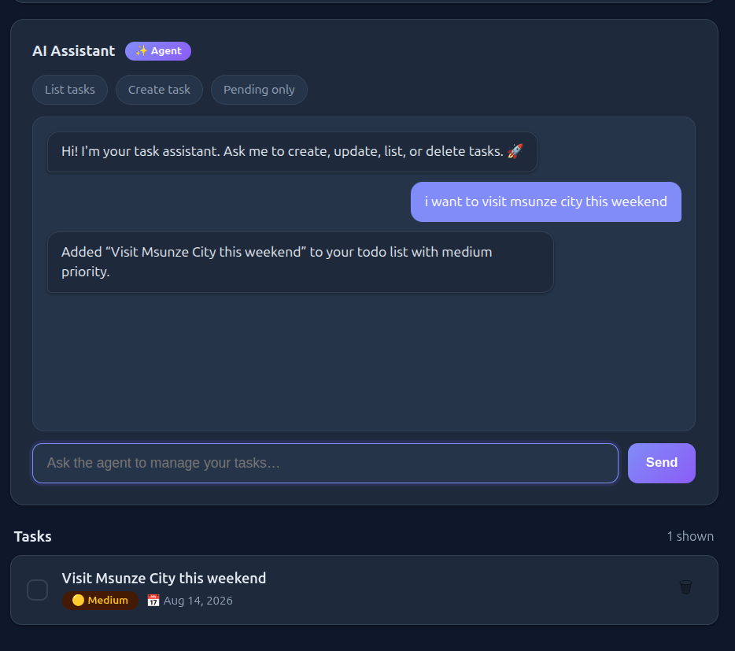
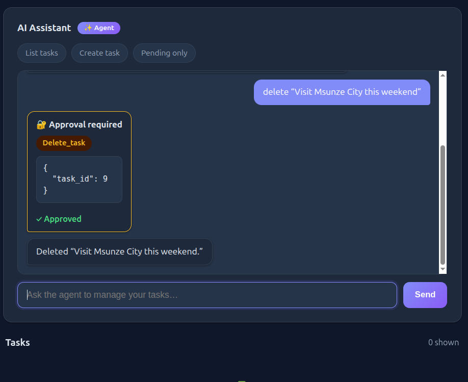

# TaskFlow - The Over-Engineered Todo App

> A todo app with an AI agent. Why? Because it's the fastest way to learn
> function calling, human-in-the-loop

## What this teaches you

 boring CRUD **plus** one genuinely interesting problem an AI agent
that can act on your data, safely.

You'll learn:


- **Function calling**: how the LLM decides *which* function to call
- **Human-in-the-loop**: why AI agents need a "may I?" step before dangerous actions


## Architecture

```
Browser (static/index.html)
   │  GET/POST /tasks   │  POST /chat, /approve
   ▼                    ▼
FastAPI app (:8000)    AI Agent API (:8080)
   │  CRUD + filters      │  Runner + function tools
   ▼                       │  calls tools via HTTP
PostgreSQL (:5432)  ◀──────┘
```

Three services, one `docker compose up`.

## The two concepts that matter

### 1. Function tools

A function tool is a **normal function the LLM is allowed to call**.

```python
from agents import function_tool

@function_tool
def delete_task(task_id: int):
    """Delete a task by its id."""
    response = httpx.delete(f"{API_BASE_URL}/tasks/{task_id}")
    response.raise_for_status()
    return {"deleted": True, "task_id": task_id}
```

When you run the agent, this happens:

1. The SDK reads the function's **name, signature, and docstring** and builds a
   **JSON schema** from it — it does *not* send your Python code to the LLM.
2. You ask: *"delete the buy milk task."*
3. The LLM returns: *"I want to call `delete_task` with `{"task_id": 4}`."*
4. The SDK runs your function, gets the result, and sends it back to the LLM.
5. The LLM turns the result into a human answer.

That's it. Function calling is just: **the LLM chooses arguments, your code
does the work.** The LLM never runs code — it only *requests* that your code runs.

Notice the docstring matters: it's what the LLM reads to understand the tool.


### 2. Human-in-the-loop

If the agent could call every tool freely, it could also **delete your whole
list because you said "clean up my tasks."** That's why dangerous tools need a
human checkpoint.

```python
@function_tool(needs_approval=True)
def delete_task(task_id: int):
    ...
```

Now the flow changes:

1. You ask to delete a task.
2. The agent **interrupts** mid-run instead of calling the tool.
3. The API returns an **interruption**: the tool name + the arguments it wanted.
4.  UI shows: *"🔐 Approval required — `delete_task` with `{"task_id": 4}`"*
   and an **Approve / Reject** button.
5. backend saves the run state, and on your click either:
   - `state.approve(interruption)` → the tool runs, task is gone, or
   - `state.reject(interruption)` → the agent is told "rejected," task survives.

This is called **human-in-the-loop** (HITL). The pattern is everywhere in real
AI products: AI drafts, human approves. It's how you get the power of an
automated agent **without** giving it the power to do damage.

**Try this experiment:** set `needs_approval=True` on `create_task` too and
watch the whole UX change. You'll understand HITL trade-offs better than any
blog post.

## Run it

```bash
cp .env.example .env        # add your OPENAI_API_KEY
docker compose up -d --build
```

Open **http://localhost:8000**.

1. *"i want to visit msunze city this weekend"* → agent calls
   `create_task` instantly. No approval. Freedom.

   

2. *"Delete visit msunze city this weekend task"* → the agent **stops and asks you**.
   Approve → gone. Reject → it sulks and nothing happens.

   


## Project map

```
app/
├── main.py       FastAPI entry + startup migration
├── database.py   DB engine & session
├── models.py     Task model (priority, assigned_to, timestamps)
├── schemas.py    Pydantic — Literal enforces priority values
├── routes.py     CRUD + filters + PUT vs PATCH
└── migrate.py    ALTER TABLE IF NOT EXISTS (lazy migrations)
ai-agent-openai/
├── tools.py      @function_tool wrappers over the HTTP API
├── agent_def.py  the agent + its tools + instructions
└── chat_api.py   /chat, /approve, CORS
static/
└── index.html    the whole UI, one file, vanilla JS
```

## Resources

The official docs behind everything in this repo — read these and this project
starts making sense:

- [Human-in-the-loop — OpenAI Agents SDK](https://openai.github.io/openai-agents-python/human_in_the_loop/) — exactly what `needs_approval=True`, interruptions, and the approve/reject flow do under the hood
- [Function calling guide — OpenAI API](https://developers.openai.com/api/docs/guides/function-calling) — why the LLM returns a tool call and your code runs it
- [Agents quickstart — OpenAI API](https://developers.openai.com/api/docs/guides/agents/quickstart) — the mental model for what an agent actually is


